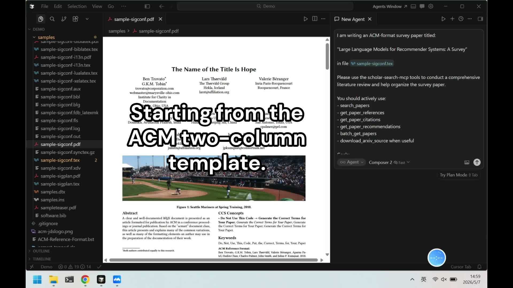

# Scholar Search MCP

An MCP server for academic literature workflows in Claude, Cursor, and other MCP clients.

It combines Semantic Scholar and arXiv into one unified toolset, with fast parallel search, normalized outputs, source-aware deduplication, and practical research utilities (citations, references, author graph, recommendations, and arXiv source download).

---

## Table of Contents

- [Why this project](#why-this-project)
- [Demo videos](#demo-videos)
- [Install](#install)
- [Quick setup (Claude Desktop / Cursor)](#quick-setup-claude-desktop--cursor)
- [Environment variables](#environment-variables)
- [Tool list](#tool-list)
- [Testing with MCP Inspector](#testing-with-mcp-inspector)
- [Contributing](#contributing)

---

## Why this project

Most paper tools force you to choose one source or one API style. `scholar-search-mcp` provides one MCP layer for literature search and graph retrieval:

- **One MCP server, multiple scholarly sources**
- **Free-first defaults** (`arXiv` works without keys)
- **LLM-friendly outputs** for downstream reasoning and agent workflows
- **Practical research actions**, not only search
- **Unified search**: `search_papers` runs Semantic Scholar + arXiv in parallel and deduplicates by normalized title.
- **Research graph tools**: details, citations, references, author profile/papers, and recommendations.
- **Batch + source workflows**: fetch up to 500 papers, and download/extract arXiv LaTeX sources.
- **Operational controls**: built-in caching plus env-based source toggles (enable/disable channels).
- **Source strategy**: built-in Semantic Scholar + arXiv, free-first by default (`arXiv` key-free), optional API key for higher Semantic Scholar limits.

## Demo videos

Agent writes a survey paper with Scholar Search MCP.

   <a href="https://youtu.be/C81rVeznoRY"></a>

<br>

## Install

```bash
pip install scholar-search-mcp
```

> Requires Python 3.10+.

## Quick setup (Claude Desktop / Cursor)

Use the same server command in both clients:

```json
{
  "mcpServers": {
    "scholar-search": {
      "command": "python",
      "args": ["-m", "scholar_search_mcp"],
      "env": {
        "SCHOLAR_SEARCH_ENABLE_SEMANTIC_SCHOLAR": "true",
        "SCHOLAR_SEARCH_ENABLE_ARXIV": "true"
      }
    }
  }
}
```

`SEMANTIC_SCHOLAR_API_KEY` is optional. Add it only if you want higher Semantic Scholar rate limits:

```json
{
  "mcpServers": {
    "scholar-search": {
      "command": "python",
      "args": ["-m", "scholar_search_mcp"],
      "env": {
        "SCHOLAR_SEARCH_ENABLE_SEMANTIC_SCHOLAR": "true",
        "SCHOLAR_SEARCH_ENABLE_ARXIV": "true",
        "SEMANTIC_SCHOLAR_API_KEY": "your-key"
      }
    }
  }
}
```

Difference:

- **Claude Desktop**: edit local config file directly.
- **Cursor**: add an MCP server in Cursor settings UI (or corresponding settings JSON).

Claude Desktop config file locations:

- **macOS**: `~/Library/Application Support/Claude/claude_desktop_config.json`
- **Windows**: `%APPDATA%\Claude\claude_desktop_config.json`
- **Linux**: `~/.config/Claude/claude_desktop_config.json`

## Environment variables

| Variable | Description |
| --- | --- |
| `SEMANTIC_SCHOLAR_API_KEY` | Optional. Increases Semantic Scholar rate limits. |
| `SCHOLAR_SEARCH_ENABLE_SEMANTIC_SCHOLAR` | `true/false`, default `true`. |
| `SCHOLAR_SEARCH_ENABLE_ARXIV` | `true/false`, default `true`. |
| `SCHOLAR_SEARCH_CACHE_DIR` | Optional cache directory path. |
| `SCHOLAR_SEARCH_CACHE_TTL_SECONDS` | Cache TTL in seconds, default `86400`. |
| `SCHOLAR_ARXIV_SOURCE_DIR` | Default parent directory for extracted arXiv sources. |

Example (`arXiv` only):

```json
{
  "SCHOLAR_SEARCH_ENABLE_SEMANTIC_SCHOLAR": "false",
  "SCHOLAR_SEARCH_ENABLE_ARXIV": "true"
}
```

## Tool list

| Tool | Purpose |
| --- | --- |
| `search_papers` | Search papers with optional `limit`, `fields`, `year`, `venue`. |
| `get_paper_details` | Get one paper by DOI, arXiv ID, S2 ID, or URL. |
| `get_paper_citations` | Get papers that cite a given paper. |
| `get_paper_references` | Get references of a given paper. |
| `get_author_info` | Get an author profile by ID. |
| `get_author_papers` | Get papers by a given author. |
| `get_paper_recommendations` | Get similar paper recommendations. |
| `batch_get_papers` | Batch fetch paper details (up to 500 IDs). |
| `download_arxiv_source` | Download and extract arXiv source bundle (`tar.gz`). |

## Testing with MCP Inspector

```bash
npm install -g @modelcontextprotocol/inspector
mcp-inspector python -m scholar_search_mcp
```

## Contributing

Issues and PRs are welcome: fork repo, create branch, add validation/tests, and open a PR with clear before/after behavior.

## References

- [Semantic Scholar API Docs](https://api.semanticscholar.org/api-docs)
- [arXiv API User Manual](https://info.arxiv.org/help/api/user-manual.html)

